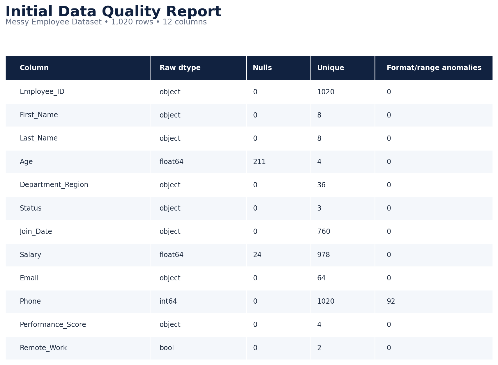
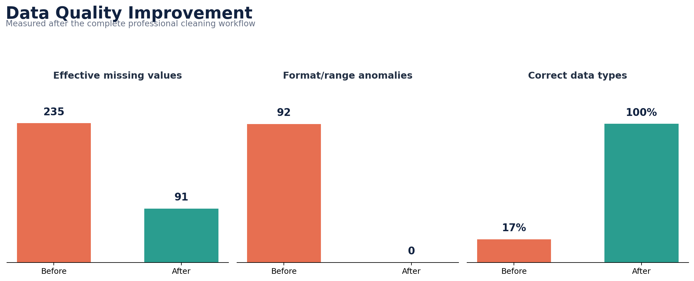
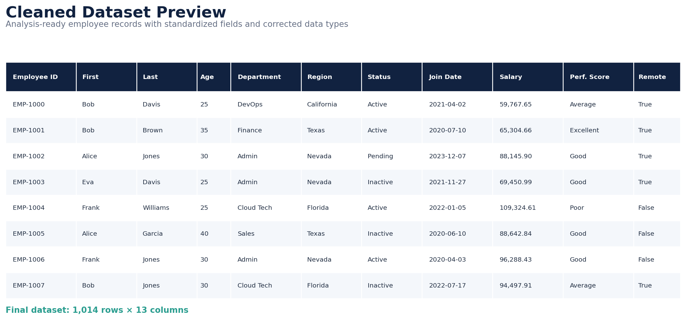
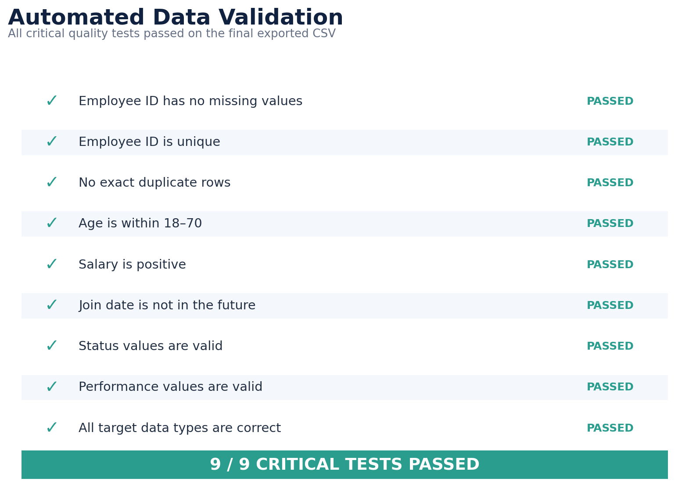

# Professional Data Cleaning Project

An end-to-end Python data-cleaning project that transforms a deliberately messy employee dataset into a validated, analysis-ready CSV. The notebook documents every decision and produces an auditable before-versus-after quality report.

## Task Information

- **Intern:** Memoon Naveed
- **Track:** Data Analytics
- **Task:** Task 3 — Professional Data Cleaning
- **Repository folder:** `OIBSIP/DataAnalytics-Task3-ProfessionalDataCleaning/`
- **Tech stack:** Python, pandas, NumPy, matplotlib, seaborn, Jupyter Notebook

## Dataset

The project uses the [Messy Employee Dataset](https://www.kaggle.com/datasets/desolution01/messy-employee-dataset) from Kaggle. It is a synthetic HR dataset released under the **CC0 1.0 Public Domain** license and intentionally contains missing values, incorrect types, compound fields, format problems, and duplicate-like employee records.

## Project Results

| Quality metric | Before | After |
|---|---:|---:|
| Rows | 1,020 | 1,014 |
| Columns | 12 | 13 |
| Effective missing values | 235 | 91 |
| Format/range anomalies | 92 | 0 |
| Exact duplicate rows | 0 | 0 |
| Correct target data types | 16.7% | 100% |
| Critical validation checks passed | — | 9/9 |

Six duplicate person records were identified using the combined business key of first name, last name, non-missing email, and join date. The remaining 91 missing values are intentionally retained phone numbers: unique contact information was not fabricated or mode-imputed.

## Cleaning Workflow

1. Loaded the raw CSV and standardized column names.
2. Produced a column-level data-quality report covering nulls, hidden missing markers, unique values, data types, and domain anomalies.
3. Standardized employee IDs to the `EMP-XXXX` format.
4. Normalized names and categorical values.
5. Split `Department_Region` into atomic `department` and `region` columns.
6. Parsed mixed date formats and rejected invalid/future dates.
7. Converted age and salary to numeric values and enforced business rules.
8. Cleaned and validated email and phone formats.
9. Imputed age and salary using department-aware medians.
10. Used mode imputation for appropriate categorical/boolean fields.
11. Applied IQR outlier detection and documented the treatment decision.
12. Removed exact and business-key duplicates.
13. Corrected all target pandas data types.
14. Ran nine automated quality assertions.
15. Exported the cleaned dataset to a new CSV.

## Missing-Value Decisions

| Column | Strategy | Reason |
|---|---|---|
| Employee ID | Delete unrecoverable rows | A primary identifier cannot be inferred safely. |
| First/last name | Use `Unknown` | Assigning another employee's name would create false identity data. |
| Age | Department median, then global median | Robust to unusual values and respects departmental composition. |
| Salary | Department median, then global median | Resistant to outliers and respects pay structure. |
| Department, region, status | Mode | Appropriate for low-cardinality categories. |
| Join date | Median valid date | Employee rows have no meaningful sequence for forward fill. |
| Performance score, remote work | Mode | Appropriate for categorical and boolean fields. |
| Email, phone | Retain missing | Unique contact information must not be invented. |

## Screenshots

### Initial data-quality report



### Before-versus-after quality improvement



### Cleaned dataset preview



### Automated validation



## Repository Contents

```text
DataAnalytics-Task3-ProfessionalDataCleaning/
├── Task_3_Professional_Data_Cleaning.ipynb
├── Messy_Employee_dataset.csv
├── Messy_Employee_dataset_cleaned.csv
├── README.md
├── requirements.txt
├── DEMO_AND_SUBMISSION_GUIDE.md
└── screenshots/
    ├── 00_demo_title_card.png
    ├── 01_initial_data_quality_report.png
    ├── 02_before_after_quality_summary.png
    ├── 03_cleaned_dataset_preview.png
    └── 04_validation_results.png
```

## How to Run

1. Clone or download the repository.
2. Open a terminal inside this project folder.
3. Install the dependencies:

   ```bash
   pip install -r requirements.txt
   ```

4. Start Jupyter Notebook:

   ```bash
   jupyter notebook
   ```

5. Open `Task_3_Professional_Data_Cleaning.ipynb` and select **Run All**.
6. Confirm that `Messy_Employee_dataset_cleaned.csv` is exported successfully.

## Key Learning

Professional data cleaning is not about forcing every column to have zero nulls. It is about applying defensible, column-specific rules while preserving accuracy, documenting trade-offs, and validating the final output before analysis.

## Author

**Memoon Naveed**  
Data Analytics Intern — Oasis Infobyte
